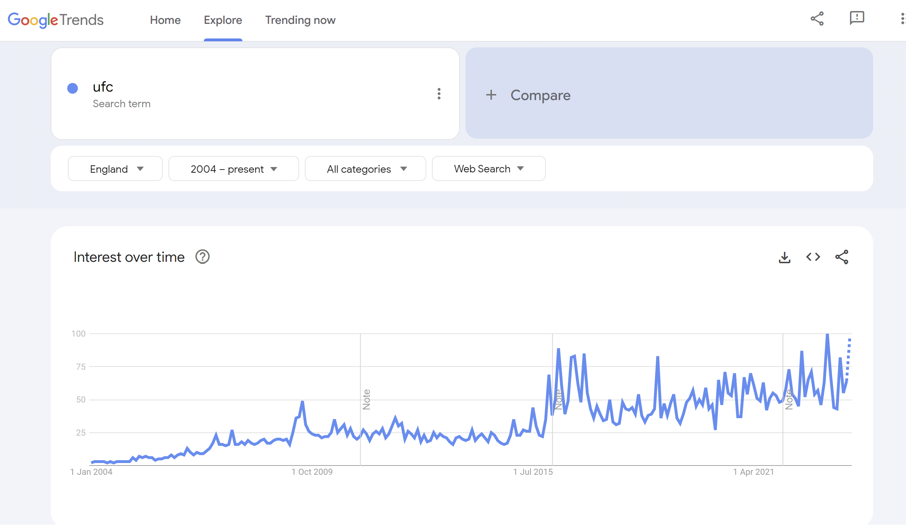
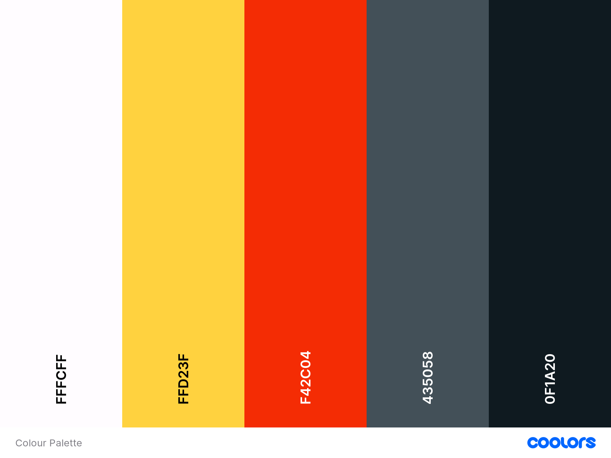

# FUSION FIGHTERS MARTIAL ARTS CLUB

The website can be viewed here [Fusion Fighters](https://davep33l.github.io/fusion_fighters/)

## High Level Site Owner Goals

Fusion Fighters Martial Arts is a multi-discipline martial arts club based in the UK. It is focused on providing training in 3 major disciplines. The 3 disciplines are Judo, which is primarily a throw-based martial art, Karate, which is primarily a striking-based martial art and Brazilian Jiu-Jitsu (BJJ), which is primarily a ground-based martial art. 

The owner and chief instructor of the club currently only promotes his club via leaflets and does not have a presence online. The owner wants to have a presence online where he can direct future members in order to provide them with information on the club and to increase membership to the club by giving visitors the ability to request more information and/or sign up. 

## Strategy

**Business Goals**: To drive new members to join the club by providing a place to showcase information on the club and to contact the club.

**Uniqueness**: Fusion Fighters Martial Arts is unique as it provides a mix of martial art disciplines that a member of the club will be trained in. Allowing the member to become a more rounded fighter vs training in one style only. 

**User Value**: As the popularity of The UFC and Mixed Martial Arts increases, it would be expected that people who are wishing to train in martial arts want variety. Fusion Fighters Martial Arts provides this variety with the 3 different styles on offer. Those being Judo, Karate and Brazilian Jiu Jitsu. It provides 3 key aspects to becoming a rounded fighter, a throw based martial art (Judo), a striking based martial art (Karate) and a ground based martial art (Brazilian Jiu Jitsu). 

**Research**: Google Trends for MMA searches from 2004 to Oct 2023 shows increase in popularity. Highlighting the mixed interest in martial arts disciplines.

## Scope

### External User Stories/Goals

1. As a user of the website I should be able to see more information on the martial arts styles that are being taught.
2. As a user of the website I should be able to see information on the benefits of martial arts.
3. As a user of the website I should be able to see the profile and experience of the instructors.
4. As a user of the website I should be able to see more about the club
5. As a user of the website I should be able to see a timetable of the classes
6. As a user of the website I should be able to see the cost of the classes
7. As a user of the website I should be able to see testimonials from current or previous members regarding the club
8. As a user of the website I should be able to contact the club for more information or to sign up
9. The site should be responsive on both mobile and desktop
10. The site should be easy to navigate to the relevant sections of the site

### Site Owner Stories/Goals

As the owner of the website I want to increase membership of the club
As the owner of the website I want to provide additional information about the club and training on offer
As the owner of the website I want it to be responsive
As the owner of the website I want it to be accessible

## Structure

### Structural Decisions

- 1 page linear navigational site for ease of use
- Will contain a hamburger menu for mobile and an expanded menu for laptop and larger
- Navigation links will navigate to different sections on the same page
- Page flow is like a what, why, who, why, when - which leads the user through a journey of information, with a sign up/contact at the bottom. 
- Start with Mobile design first in a basic column based view, and improve the layout when expanding screen size
- Ensure that there is content hinting, which shows the next section at the bottom of the screen

### Basic Site Map

- Header
    - Logo
    - Nav
- Main
    - Hero
    - Styles
    - Benefits
    - Instructors
    - About
    - Timetable/Prices
    - Testimonials
    - Contact/Get in Touch
- Footer
    - Social Links

## Skeleton

### Wire-frames

## Surface

### Typography

Fonts for the site were obtained from google-fonts. The fonts chosen were.

1. [Cinzel](https://fonts.google.com/?query=cinzel)
2. [Philosopher](https://fonts.google.com/?query=philosopher)

### Colours

I had an idea for the colours I wanted for the website already, and I used coolers to visualize these all together.

I chose a strong black to symbolize a Black Belt, which is generally the highest level belt a martial arts practitioner can attain.

I chose a grey, to be an accent tone to this.

I chose the yellow/gold as it symbolizes winning (gold medals) and is also the most common colour used for martial art belt embroidery.

I chose the red as it is also a common colour used on martial art belt embroidery. 

I chose a slightly off white as my light colour.

### Images

The Favicon was obtained from [icon8s.com](https://icons8.com/icon/KYBCho8WVA7Z/kimono) and I used [favicon.io](https://favicon.io/favicon-converter/) to generate the size specific favicons. 

Hero background photo by [Thao Lee](https://unsplash.com/@h4x0r3?utm_content=creditCopyText&utm_medium=referral&utm_source=unsplash) from [Unsplash](https://unsplash.com/photos/woman-wearing-karatejee-uGlJHMEifB4?utm_content=creditCopyText&utm_medium=referral&utm_source=unsplash)

Judo styles photo by [master1305](https://www.freepik.com/author/master1305) from [Freepik](https://www.freepik.com/free-photo/two-young-fighters-kimono-training-martial-arts-gym_7785559.htm#query=judo&position=3&from_view=keyword&track=sph)

Karate styles photo by [Soon Santos](https://unsplash.com/@soonsam?utm_content=creditCopyText&utm_medium=referral&utm_source=unsplash) from [Unsplash](https://unsplash.com/photos/two-men-about-to-sparring-sab37qbGmHc?utm_content=creditCopyText&utm_medium=referral&utm_source=unsplash)

Brazilian Jiu-Jitsu styles photo by [Nathan Dumlao](https://unsplash.com/@nate_dumlao?utm_content=creditCopyText&utm_medium=referral&utm_source=unsplash) from [Unsplash](https://unsplash.com/photos/man-in-white-and-black-jacket-and-pants-sitting-on-black-floor-YmNIHXdTfPg?utm_content=creditCopyText&utm_medium=referral&utm_source=unsplash)

Judo instructor photo by [Nathan Dumlao](https://unsplash.com/@nate_dumlao?utm_content=creditCopyText&utm_medium=referral&utm_source=unsplash) from [Unsplash](https://unsplash.com/photos/a-man-in-a-white-kimono-sitting-down-YSzuRTO5WFY?utm_content=creditCopyText&utm_medium=referral&utm_source=unsplash)

Karate instructor photo by [Thao Lee](https://unsplash.com/@h4x0r3?utm_content=creditCopyText&utm_medium=referral&utm_source=unsplash) from [Unsplash](https://unsplash.com/photos/woman-in-white-long-sleeve-shirt-and-gray-pants-wearing-brown-hat-o59vMsBuuSg?utm_content=creditCopyText&utm_medium=referral&utm_source=unsplash)

Brazilian Jiu-Jitsu instructor photo by [jahir martinez](https://unsplash.com/@jahirmg?utm_content=creditCopyText&utm_medium=referral&utm_source=unsplash) from [Unsplash](https://unsplash.com/photos/man-in-white-button-up-long-sleeve-shirt-holding-black-and-red-skateboard-cVLOqm8sSXc?utm_content=creditCopyText&utm_medium=referral&utm_source=unsplash)

About Section background image by [Nathan Dumlao](https://unsplash.com/@nate_dumlao?utm_content=creditCopyText&utm_medium=referral&utm_source=unsplash) from [Unsplash](https://unsplash.com/photos/people-sitting-on-floor-in-front-of-white-wall-DT3bb-KDAus?utm_content=creditCopyText&utm_medium=referral&utm_source=unsplash)

## Accessibility

## Technologies Used

This website was created using HTML and CSS.

The wire-frames were created using [Balsamiq for Desktop](https://balsamiq.com/wireframes/desktop/).

Images were resized using [Adobe Express](https://www.adobe.com/express/feature/image/resize)

Images were compressed using [tinypng](https://tinypng.com/)

Images were converted to webp format using [convertio.co](https://convertio.co/)

Used the Code Spell Checker Extension in VS Code to review spelling on this README.md file

## Deployment 

1. Ensure the relevant Github repo is selected
2. Ensure that the repo is set to public
3. Navigate to the settings on the ribbon navigation bar
4. Navigate to the pages section on the left navigation bar
5. Under Build and Deployment ensure the source is set to "deploy from branch"
6. Select "main" under the branch section and folder as "/root" and select save
7. Navigate to Actions on the ribbon navigation bar
8. There will be a "pages build and deployment" with a green tick if successful
9. Select this workflow action and there will be a link under the deploy aspect of the workflow
10. Select the link to view the site
11. The link for this site is https://davep33l.github.io/fusion_fighters/

## Testing

Chrome Dev Tools was used throughout the development of the website, utilizing the Lighthouse functionality to highlight any performance  accessibility improvements that could be made. 

Chrome Dev Tools specifically helped with the concurrence of my image sizes and adding heights and widths to images to prevent content layout shift.

HTML was tested using the [W3C HTML Validator](https://validator.w3.org/)

CSS was tested using Jigsaw, the [W3C CSS Validator](https://jigsaw.w3.org/css-validator/)

## Acknowledgements / Credits

The idea for coolers was from the readme webinar from Kera Cudmore (Thank you if you read this)

I referenced [Mozilla Developer Network](https://developer.mozilla.org/en-US/docs/Web/HTML) throughout this project.

Feedback from mid-project mentor session highlighted inconsistency of the space to the left and right of each of the sections. On this feedback I adjusted the padding of each container from 2rem to 1rem and removed some styles that were overriding the 100% width (which I had previously set to 80% width). 