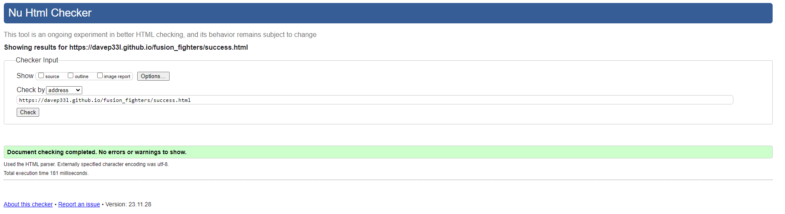

# FUSION FIGHTERS MARTIAL ARTS CLUB WEBSITE

The website can be viewed [here](https://davep33l.github.io/fusion_fighters/).

## High Level Site Owner Goals

Fusion Fighters Martial Arts is a multi-discipline martial arts club based in the UK. It is focused on providing training in 3 major disciplines. The 3 disciplines are Judo, which is primarily a throw-based martial art, Karate, which is primarily a striking-based martial art and Brazilian Jiu-Jitsu (BJJ), which is primarily a ground-based martial art. 

The owner and chief instructor of the club currently only promotes his club via leaflets and does not have a presence online. The owner wants to have a presence online where he can direct future members in order to provide them with information on the club and to increase membership to the club by giving visitors the ability to request more information and/or sign up. 

## Strategy

**Business Goals**: To drive new members to join the club by providing a place to showcase information on the club and to contact the club.

**Uniqueness**: Fusion Fighters Martial Arts is unique as it provides a mix of martial art disciplines that a member of the club will be trained in. Allowing the member to become a more rounded fighter vs training in one style only. 

**User Value**: As the popularity of The UFC and Mixed Martial Arts increases, it would be expected that people who are wishing to train in martial arts want variety. Fusion Fighters Martial Arts provides this variety with the 3 different styles on offer. Those being Judo, Karate and Brazilian Jiu Jitsu. It provides 3 key aspects to becoming a rounded fighter, a throw based martial art (Judo), a striking based martial art (Karate) and a ground based martial art (Brazilian Jiu Jitsu). 

**Research**: Google Trends for UFC (the primary mixed martial arts franchise in the world) searches from 2004 to Oct 2023 shows increase in popularity. Highlighting the interest in mixed martial arts disciplines.

## Scope

### User Stories/Goals

1. As a user of the website I should be able to see more information on the martial arts styles that are being taught.
2. As a user of the website I should be able to see information on the benefits of martial arts.
3. As a user of the website I should be able to see the profile and experience of the instructors.
4. As a user of the website I should be able to see more about the club
5. As a user of the website I should be able to see a timetable of the classes
6. As a user of the website I should be able to see the cost of the classes
7. As a user of the website I should be able to see testimonials from current or previous members regarding the club
8. As a user of the website I should be able to contact the club for more information or to sign up
9. The site should be responsive on both mobile and desktop
10. The site should be easy to navigate to the relevant sections of the site

## Structure

### Structural Decisions

- 1 page linear navigational site for ease of use
- Will contain a hamburger menu for mobile and an expanded menu for laptop and larger
- Navigation links will navigate to different sections on the same page
- Page flow is like a what, why, who, why, when - which leads the user through a journey of information, with a sign up/contact at the bottom. 
- Start with Mobile design first in a basic column based view, and improve the layout when expanding screen size
- Ensure that there is content hinting, which shows the next section at the bottom of the screen

### Basic Site Map

#### Home Page

- Header
    - Logo
    - Nav
- Main
    - Hero
    - Styles
    - Benefits
    - Instructors
    - About
    - Timetable/Prices
    - Testimonials
    - Contact/Get in Touch
- Footer
    - Social Links

### Additional pages

#### 404 Redirect Page

- Header
    - Logo
    - Nav
- Main
    - 404 information with return home link
- Footer
    - Social Links

#### Success / Thank you page Page

- Header
    - Logo
    - Nav
- Main
    - Thank you note with return home link
- Footer
    - Social Links

## Skeleton

### Wire-frames

[Mobile Wireframe](readme/mobile-wireframe.png)

[Desktop Wireframe](readme/desktop-wireframe.png)

## Surface

### Typography

As most martial arts have a heritage dating back to Eastern Asia, I wanted to reflect this within the typography. The fonts chosen maintain a degree of flourishes to link back to East Asian written languages, but also contain striking straight lines to symbolise martial arts in the modern era, making both fonts both classic, modern and elegant. 

Fonts for the site were obtained from google-fonts. The fonts chosen were:

1. [Cinzel](https://fonts.google.com/?query=cinzel)

2. [Philosopher](https://fonts.google.com/?query=philosopher)

### Colours

I took inspiration for my colours from what Martial Artist wear. That being the Gi and the Black Belt. I used the coolers website to visualize these all together.

I chose a strong dark colour to symbolize a Black Belt, which is generally the highest level belt a martial arts practitioner can attain. This is not entirly black, as throughout the time as a practitioner, the belt fades giving a slightly blue tinge. 

I chose a grey, to be an accent tone to this, and use where I did not require such a dark colour. 

I chose the yellow/gold as it symbolizes winning (gold medals) and is also the most common colour used for martial art belt embroidery.

I chose a striking scarlet red as it is also a common colour used on martial art belt embroidery and uniform emblems. 

I chose a very slightly off white as my light colour as this is the main colour for a martial arts gi.

### Images

The images to be used will highlight the colours outlined above, showcasing blacks and whites predominantly. Below is a table of all the images/favicons used, along with the sources.  

| Image Purpose  | Type  | Author  | Source  | Additional info   |
|----------------|-------|---------|---------|-------------------|
| Favicon  | [Favicon](https://icons8.com/icon/KYBCho8WVA7Z/kimono)  | [icon8s.com](https://icons8.com)  | [icon8s.com](https://icons8.com)  | [favicon.io](https://favicon.io/favicon-converter/) was used to generate the size specific favicons  |
| Hero Background  | [Image](https://unsplash.com/photos/woman-wearing-karatejee-uGlJHMEifB4?utm_content=creditCopyText&utm_medium=referral&utm_source=unsplash)  | [Thao Lee](https://unsplash.com/@h4x0r3?utm_content=creditCopyText&utm_medium=referral&utm_source=unsplash)  | [Unsplash](https://unsplash.com)  |   |
| Judo Style  | [Image](https://www.freepik.com/free-photo/two-young-fighters-kimono-training-martial-arts-gym_7785559.htm#query=judo&position=3&from_view=keyword&track=sph)  | [master1305](https://www.freepik.com/author/master1305)  | [Freepik](https://www.freepik.com/)  |   |
| Karate Style  | [Image](https://unsplash.com/photos/two-men-about-to-sparring-sab37qbGmHc?utm_content=creditCopyText&utm_medium=referral&utm_source=unsplash)  | [Soon Santos](https://unsplash.com/@soonsam?utm_content=creditCopyText&utm_medium=referral&utm_source=unsplash)  |  [Unsplash](https://unsplash.com) |   |
| Brazilian Jiu-Jitsu Style  | [Image](https://unsplash.com/photos/man-in-white-and-black-jacket-and-pants-sitting-on-black-floor-YmNIHXdTfPg?utm_content=creditCopyText&utm_medium=referral&utm_source=unsplash)  | [Nathan Dumlao](https://unsplash.com/@nate_dumlao?utm_content=creditCopyText&utm_medium=referral&utm_source=unsplash)  | [Unsplash](https://unsplash.com)  |   |
| Judo Instructor  | [Image](https://unsplash.com/photos/a-man-in-a-white-kimono-sitting-down-YSzuRTO5WFY?utm_content=creditCopyText&utm_medium=referral&utm_source=unsplash)  | [Nathan Dumlao](https://unsplash.com/@nate_dumlao?utm_content=creditCopyText&utm_medium=referral&utm_source=unsplash)  | [Unsplash](https://unsplash.com)  |   |
| Karate Instructor  | [Image](https://unsplash.com/photos/woman-in-white-long-sleeve-shirt-and-gray-pants-wearing-brown-hat-o59vMsBuuSg?utm_content=creditCopyText&utm_medium=referral&utm_source=unsplash)  | [Thao Lee](https://unsplash.com/@h4x0r3?utm_content=creditCopyText&utm_medium=referral&utm_source=unsplash)  | [Unsplash](https://unsplash.com)  |   |
| Brazilian Jiu-Jitsu Instructor  | [Image](https://unsplash.com/photos/man-in-white-button-up-long-sleeve-shirt-holding-black-and-red-skateboard-cVLOqm8sSXc?utm_content=creditCopyText&utm_medium=referral&utm_source=unsplash)  | [jahir martinez](https://unsplash.com/@jahirmg?utm_content=creditCopyText&utm_medium=referral&utm_source=unsplash)  | [Unsplash](https://unsplash.com) |   |
| About Section Background  | [Image](https://unsplash.com/photos/people-sitting-on-floor-in-front-of-white-wall-DT3bb-KDAus?utm_content=creditCopyText&utm_medium=referral&utm_source=unsplash)  | [Nathan Dumlao](https://unsplash.com/@nate_dumlao?utm_content=creditCopyText&utm_medium=referral&utm_source=unsplash)  | [Unsplash](https://unsplash.com)  |   |
| Review Section Profile  | [Image](https://www.freepik.com/free-vector/avatars-circles-glyph-style_77972574.htm#query=profile%20placeholder&position=12&from_view=search&track=ais&uuid=5b1c1e94-1475-4546-9010-864854ff1300)  | [juicy_fish](https://www.freepik.com/author/juicy-fish)  | [Freepik](https://www.freepik.com/)  | Additional editing to change the colours of the images perfomed by myself using [GIMP](https://www.gimp.org/)  |
| Contact Section Background  | [Image](https://www.freepik.com/free-photo/young-girl-karate-costume-outdoor_5783838.htm#page=2&query=martial%20arts&position=5&from_view=search&track=ais&uuid=5527b174-dce7-4115-9814-db3b0d322e8b)  | [master1305](https://www.freepik.com/author/master1305)  | [Freepik](https://www.freepik.com/)  |   |
| 404 Redirect Background  | [Image](https://unsplash.com/photos/person-wearing-black-belt-judo-urBiLDuUhMU?utm_content=creditCopyText&utm_medium=referral&utm_source=unsplash)  | [Leslie Jones](https://unsplash.com/@les_elizabethj?utm_content=creditCopyText&utm_medium=referral&utm_source=unsplash)  | [Unsplash](https://unsplash.com)  |   |
| Success / Thank you Background  | [Image](https://unsplash.com/photos/S-bwUNN1hos?utm_content=creditCopyText&utm_medium=referral&utm_source=unsplash)  | [Leslie Jones](https://unsplash.com/@les_elizabethj?utm_content=creditCopyText&utm_medium=referral&utm_source=unsplash)  | [Unsplash](https://unsplash.com)  |   |

## Technologies Used

### Languages Used

This website was created using HTML and CSS.

### Frameworks, Libraries and Software Used

| What  | Type  | Category  | Purpose  |   
|---|---|---|---|
| [Balsamiq](https://balsamiq.com/wireframes/desktop/) | Desktop Software  | Wireframe  | This was used to create the wireframes for this project  |   
| [Adobe Express](https://www.adobe.com/express/feature/image/resize) | Online Software  | Image Editing  | This was used to resize image where required  |   
| [tinypng](https://tinypng.com/)  | Online Software  | Image Editing  | This was used to compress images  |   
| [convertio.co](https://convertio.co/)  | Online Software  | Image Editing  | This was used to convert images to webp format where required  |   
| [Gimp](https://www.gimp.org/)  | Desktop Software  | Image Editing  | This was used to edit the colours in the profile images on the review section to red and yellow.  |   
| [Google Fonts](https://fonts.google.com/) | Font Library  | Fonts  | This was used to obtain the two main fonts for the website and imported to the style.css file  |   
| [Font Awesome](https://fontawesome.com/)  | Font Library  | Fonts  |  This was used to add icons to the navigation bar and to the social media icons |
| [Git](https://git-scm.com/)  | Desktop Software  | Version Control  | This was used as version control from the terminal inside VS Code and was pushed to a remote repository hosted by github.com  |
| [Github](https://github.com/)  | Online Software  | Version Control  | This was used to store the code used for the website and to host the website using github pages  |
| [VS Code](https://code.visualstudio.com/) | Desktop Software  | Development  | The was the application used to develop the website. I used some extensions to assist with the development. Those being: ***Live Server, Code Spell Checker, Markdown Preview Github Styling, Git Graph***  |

## Deployment 

### Github Pages

This project was deployed to Github Pages using the following process:

1. Log in to Github
2. Ensure the relevant Github repository is selected
3. Navigate to the settings on the ribbon navigation bar
4. Ensure that the repository is set to public. This setting is at the bottom of the page in the "Danger Zone" section
5. Navigate to the pages section on the left navigation bar
6. Under Build and Deployment ensure the source is set to "deploy from branch"
7. Select "main" under the branch section and folder as "/root" and select save
8. Navigate to Actions on the ribbon navigation bar
9. There will be a "pages build and deployment" with a green tick if successful
10. Select this workflow action and there will be a link under the deploy aspect of the workflow
11. Select the link to view the site
12. The link for this site is https://davep33l.github.io/fusion_fighters/

## Testing

Chrome Dev Tools was used throughout the development of the website, utilizing the Lighthouse functionality to highlight any performance  accessibility improvements that could be made. 

Chrome Dev Tools specifically helped with the concurrence of my image sizes and adding heights and widths to images to prevent content layout shift.

HTML was tested using the [W3C HTML Validator](https://validator.w3.org/)

CSS was tested using Jigsaw, the [W3C CSS Validator](https://jigsaw.w3.org/css-validator/)

### Index.html

### 404.html

### success.html

## Acknowledgements / Credits

The idea for coolers was from the readme webinar from Kera Cudmore (Thank you if you read this)

I referenced [Mozilla Developer Network](https://developer.mozilla.org/en-US/docs/Web/HTML) throughout this project.

Feedback from mid-project mentor session highlighted inconsistency of the space to the left and right of each of the sections. On this feedback I adjusted the padding of each container from 2rem to 1rem and removed some styles that were overriding the 100% width (which I had previously set to 80% width). 